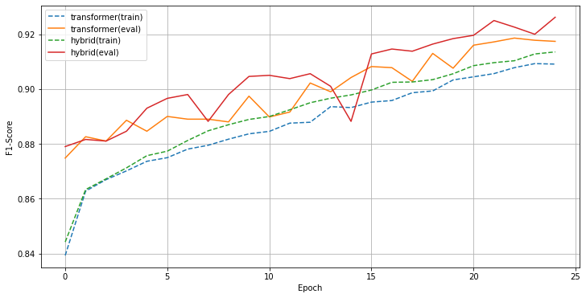

# FrozenBERT+SentiDict

## Install
```bash
### Install dependencies
pip install -r requirements.txt

### TODO document nltk stop word downloader
```

## Usage

### Predefined Experiments:
```bash
### 
### Use following make calls to run predefined experiments (only OSX/LINUX):

# run train/eval all model types on 100% train data
make exp_train.1.000

# TODO 10%, 1%, 0.1% train data calls
```

## Results (TBC)

#### Transformer v. Hybrid on Train/Eval F1-Score


#### Linguistic(eval): 0.8034 F1/ACC
```bash
AVG           	 tp:     4017	 fp:      983 	 tn:     4017	 fn:      983	 pre=0.8034	 rec=0.8034	 f1=0.8034	 acc=0.8034
negative      	 tp:     2093	 fp:      561 	 tn:     1924	 fn:      422	 pre=0.7886	 rec=0.8322	 f1=0.8098	 acc=0.8034
positive      	 tp:     1924	 fp:      422 	 tn:     2093	 fn:      561	 pre=0.8201	 rec=0.7742	 f1=0.7965	 acc=0.8034
```

#### Transformer(eval): 0.9186 F1/ACC
```bash
AVG           	 tp:     4593	 fp:      407 	 tn:     4593	 fn:      407	 pre=0.9186	 rec=0.9186	 f1=0.9186	 acc=0.9186
negative      	 tp:     2318	 fp:      210 	 tn:     2275	 fn:      197	 pre=0.9169	 rec=0.9217	 f1=0.9193	 acc=0.9186
positive      	 tp:     2275	 fp:      197 	 tn:     2318	 fn:      210	 pre=0.9203	 rec=0.9155	 f1=0.9179	 acc=0.9186

```

#### Hybrid(eval): **0.9262** F1/ACC
```bash
AVG           	 tp:     4631	 fp:      369 	 tn:     4631	 fn:      369	 pre=0.9262	 rec=0.9262	 f1=0.9262	 acc=0.9262
negative      	 tp:     2363	 fp:      217 	 tn:     2268	 fn:      152	 pre=0.9159	 rec=0.9396	 f1=0.9276	 acc=0.9262
positive      	 tp:     2268	 fp:      152 	 tn:     2363	 fn:      217	 pre=0.9372	 rec=0.9127	 f1=0.9248	 acc=0.9262
```

## Credits:

* NLP-Progress Sentiment Analysis (IMDb): <http://nlpprogress.com/english/sentiment_analysis.html#imdb>
